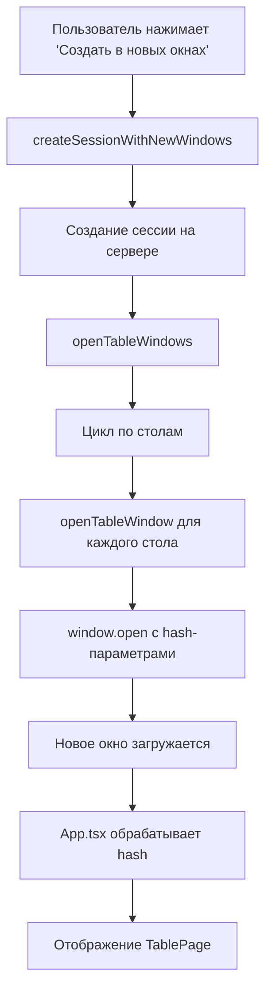

# 🪟 Функциональность новых окон для покерных столов

## Описание

Реализована возможность открытия каждого покерного стола в отдельном окне браузера, как это делается на профессиональных покерных сайтах (PokerStars, 888poker и др.).

## Основные возможности

### 🎯 Два режима создания сессии

1. **🪟 Создать в новых окнах** - каждый стол открывается в отдельном окне
2. **🚀 Создать в этом окне** - традиционный режим с отображением всех столов в одном окне

### 🔧 Технические особенности

#### Автоматическое позиционирование окон
- Каждое новое окно смещается на 50px по X и Y осям
- Размер окон: 1200x800 пикселей
- Окна открываются с задержкой 300ms между собой

#### Настройки окон
```javascript
const windowFeatures = [
  'width=1200',
  'height=800',
  'resizable=yes',      // Можно изменять размер
  'scrollbars=yes',     // Полосы прокрутки при необходимости
  'status=no',          // Без строки состояния
  'menubar=no',         // Без меню браузера
  'toolbar=no',         // Без панели инструментов
  'location=no'         // Без адресной строки
];
```

#### Передача параметров через URL Hash
Параметры передаются через hash URL для обеспечения работы в новых окнах:
```
http://localhost:3000#table?sessionId=xxx&tableId=1&playerNames=[...]&betSizes={...}
```

## Архитектура решения

### Компоненты

#### 1. `SetupPage.tsx`
- **`createSessionWithNewWindows()`** - создает сессию и открывает новые окна
- **`openTableWindows()`** - управляет открытием множественных окон
- **`openTableWindow()`** - открывает отдельное окно стола

#### 2. `TablePage.tsx`
- Новый компонент для отображения отдельного стола
- Получает параметры через props
- Включает функции экспорта и закрытия окна
- Автоматически устанавливает заголовок окна

#### 3. `App.tsx`
- Обработка hash-параметров при загрузке
- Автоматическое переключение в режим отдельного стола
- Парсинг параметров из URL

### Логика работы



## Пользовательский интерфейс

### Заголовок окна стола
```
🎯 Покерный стол #1 - Сессия 12345678...
```

### Кнопки управления
- **📤 Экспорт (N)** - экспорт hand histories (появляется после первой руки)
- **❌ Закрыть** - закрытие окна стола

### Статистика стола
- Количество сыгранных рук
- Номер стола
- ID сессии

## Преимущества

### 🎮 Игровой опыт
- **Мультитейблинг** - возможность играть на нескольких столах одновременно
- **Независимые окна** - каждый стол работает независимо
- **Профессиональный вид** - как на настоящих покерных сайтах

### 💻 Техническая гибкость
- **Масштабируемость** - легко добавить больше столов
- **Производительность** - каждое окно изолировано
- **Удобство** - можно расположить окна на разных мониторах

### 🔧 Функциональность
- **Автоматический экспорт** - для каждого стола отдельно
- **Умное позиционирование** - окна не накладываются
- **Обработка ошибок** - предупреждения о блокировке всплывающих окон

## Совместимость

### Браузеры
- ✅ Chrome/Chromium
- ✅ Firefox
- ✅ Safari
- ✅ Edge

### Требования
- Разрешение всплывающих окон для сайта
- JavaScript включен
- Минимальное разрешение экрана: 1280x720

## Использование

### Шаг 1: Настройка
1. Выберите диапазоны рук для игроков
2. Настройте параметры борда
3. Укажите количество столов

### Шаг 2: Создание сессии
1. Нажмите **"🪟 Создать в новых окнах"**
2. Разрешите всплывающие окна при запросе браузера
3. Дождитесь открытия всех окон

### Шаг 3: Игра
1. Каждое окно содержит отдельный покерный стол
2. Играйте независимо на каждом столе
3. Используйте экспорт для сохранения результатов

## Устранение неполадок

### Окна не открываются
**Причина:** Браузер блокирует всплывающие окна
**Решение:** 
1. Разрешите всплывающие окна для сайта
2. В Chrome: Настройки → Конфиденциальность → Настройки сайта → Всплывающие окна

### Окна накладываются
**Причина:** Ошибка в позиционировании
**Решение:** Перетащите окна вручную или перезапустите сессию

### Стол не загружается
**Причина:** Неверные параметры в URL
**Решение:** Закройте окно и создайте новую сессию

## Будущие улучшения

- 🎨 Настраиваемые размеры окон
- 📱 Адаптация для мобильных устройств  
- 🔄 Синхронизация между окнами
- 💾 Сохранение позиций окон
- 🎵 Звуковые уведомления для каждого стола 